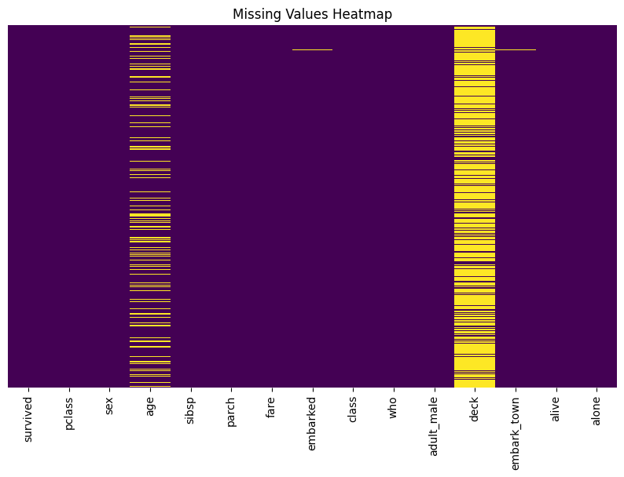
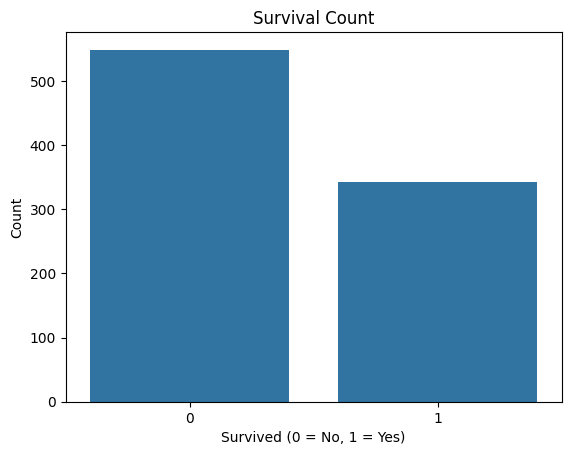
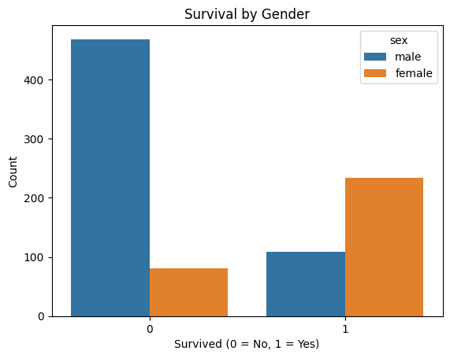
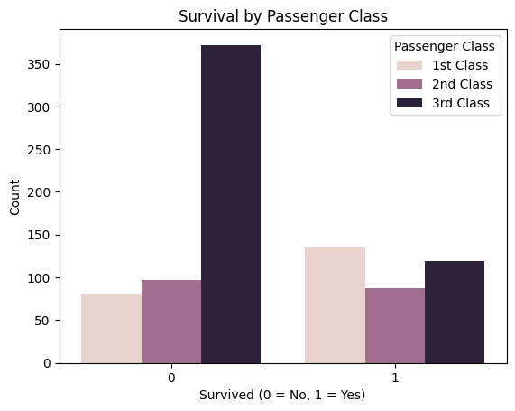
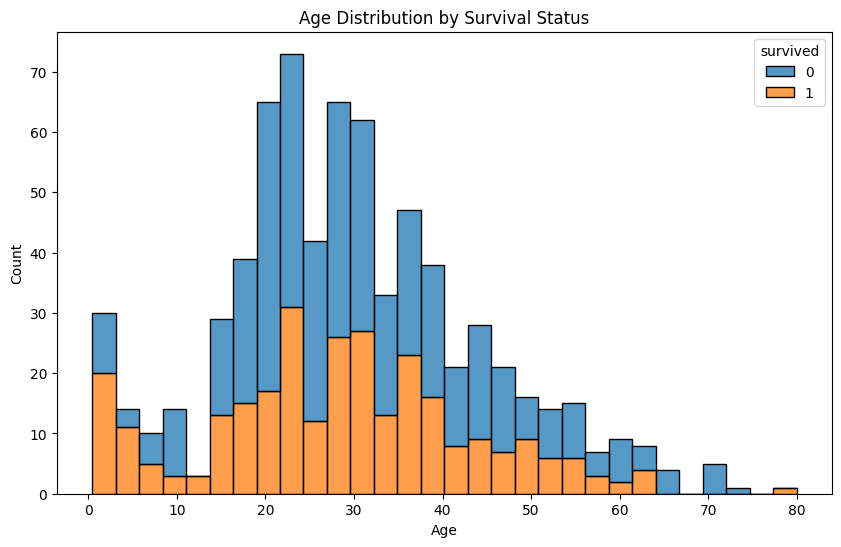
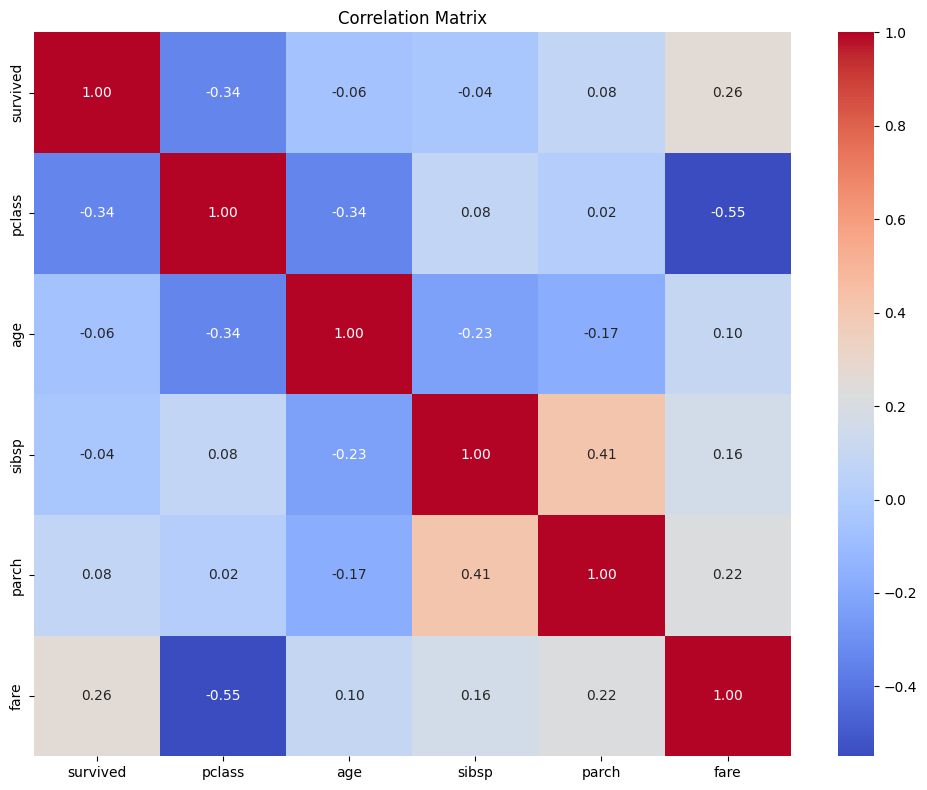
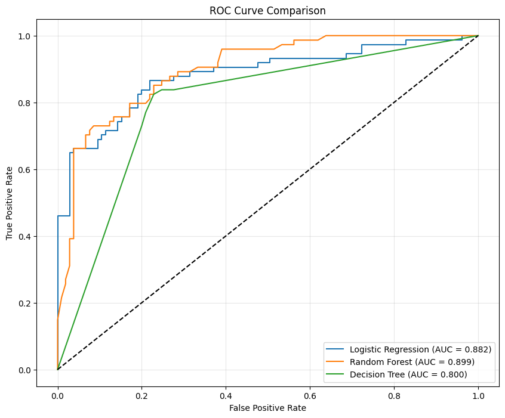
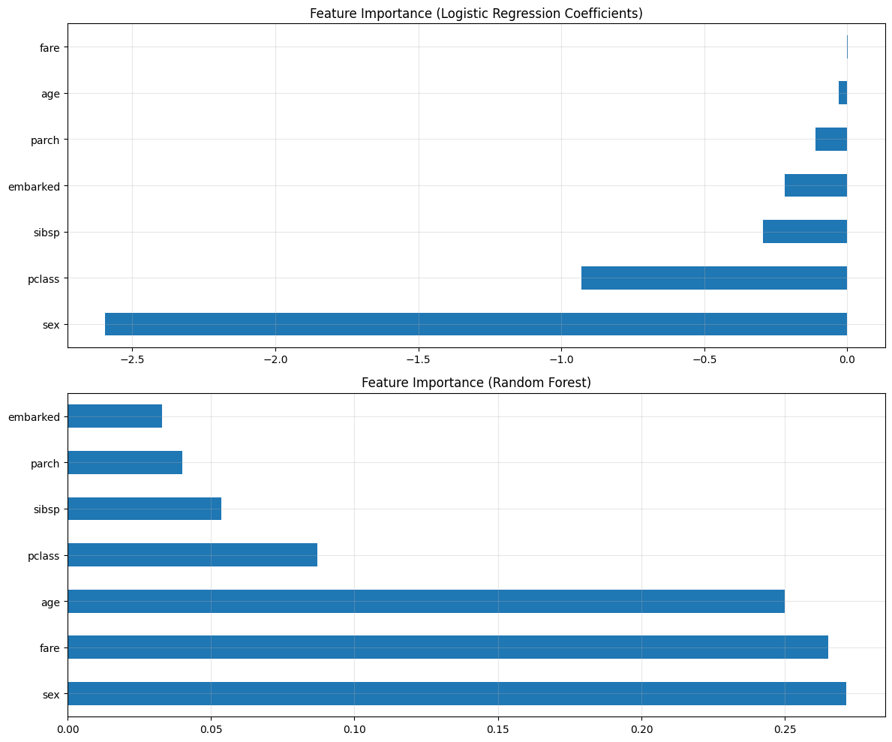

# Titanic Survival Prediction


## Project Overview

This project explores the famous Titanic dataset and builds machine learning models to predict passenger survival. The sinking of the RMS Titanic is one of the most infamous shipwrecks in history, where 1,502 out of 2,224 passengers and crew lost their lives.

## Table of Contents
- [Introduction](#introduction)
- [Data Exploration](#data-exploration)
- [Data Preprocessing](#data-preprocessing)
- [Model Building](#model-building)
- [Model Evaluation](#model-evaluation)
- [Feature Importance](#feature-importance)
- [Prediction Function](#prediction-function)
- [Conclusion](#conclusion)

## Introduction

The goal of this project is to predict which passengers survived the Titanic shipwreck based on features like age, sex, passenger class, and others. This is a classic binary classification problem in machine learning.

## Data Exploration

The initial exploration revealed several interesting patterns in the data:

### Missing Values Visualization


### Survival Count


### Survival by Gender


As shown in the visualization, females had a much higher survival rate than males, which aligns with the "women and children first" protocol followed during the disaster.

### Survival by Passenger Class


Passengers in higher classes (1st class) had better chances of survival compared to those in lower classes.

### Age Distribution by Survival Status


The age distribution shows that children had higher survival rates, while most adult males perished.

## Data Preprocessing

The preprocessing steps included:
- Handling missing values
- Converting categorical features to numerical representations
- Feature selection and engineering
- Splitting data into training and test sets

## Model Building

Multiple models were trained to predict passenger survival:
- Logistic Regression
- Random Forest
- Decision Tree

## Model Evaluation

### ROC Curves


The ROC curves show that Random Forest performed the best among all models with the highest AUC (Area Under Curve) score.

## Feature Importance

### Feature Importance Analysis


The feature importance analysis revealed that:
- Sex was the most important feature for predicting survival
- Passenger class (pclass) was the second most important
- Age and fare also played significant roles

## Prediction Function

A prediction function was created to easily predict survival probability for new passenger data:

```python
def predict_survival(pclass, sex, age, sibsp=0, parch=0, fare=30, embarked='S'):
    # Create a DataFrame with the input features
    # ... [code details]
    
    # Returns survival probability and model predictions
    return {
        'survival_probability': avg_prob,
        'would_survive': avg_prob > 0.5
    }
```

Example predictions:


## Conclusion

The analysis of the Titanic dataset revealed several key insights:

1. **Data Exploration Insights**:
   - Women and children had higher survival rates
   - Passengers in higher classes (1st class) had better survival chances
   - Age played a significant role in survival probability

2. **Model Performance**:
   - Random Forest performed the best among our models
   - The most important features for prediction were sex, class, and age

3. **Next Steps**:
   - Further feature engineering could improve model performance
   - Testing more advanced models like XGBoost or Neural Networks
   - Using cross-validation for more robust evaluation

## Technologies Used
- Python 3
- Pandas
- NumPy
- Scikit-learn
- Matplotlib
- Seaborn

## How to Run
1. Clone this repository
2. Install required packages: `pip install pandas numpy scikit-learn matplotlib seaborn`
3. Run the Jupyter notebook: `jupyter notebook Titanic_Survival_Prediction.ipynb`

---

*Project by Khushboo Kumari*
